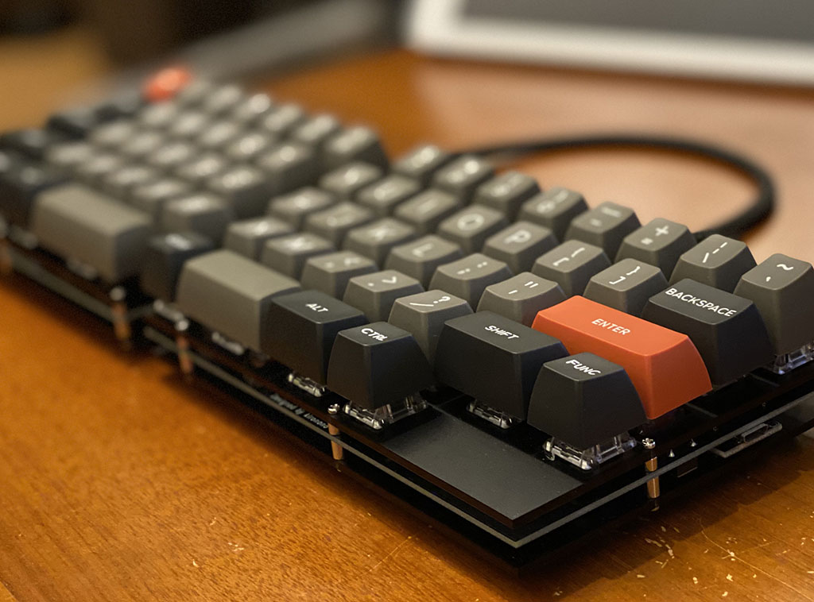
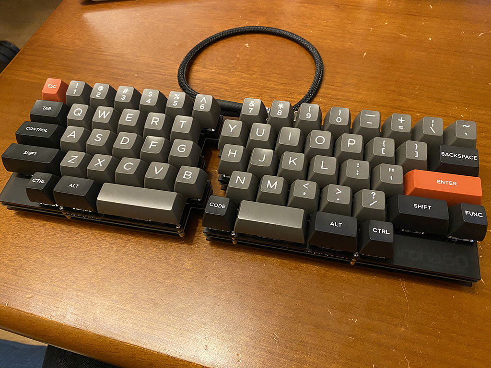
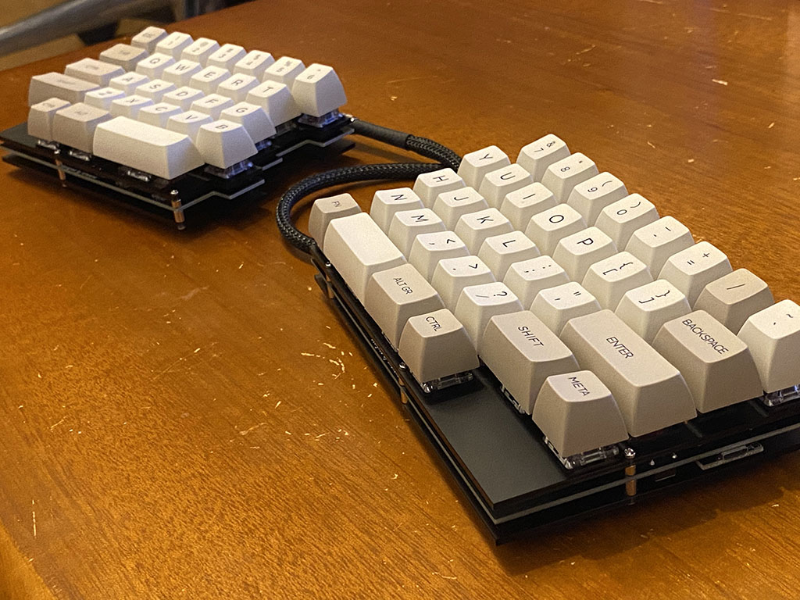

# iroha

The iroha is a split keyboard inspired by the HHKB layout.

## Variation of iroha

- iroha60:
 60% split keyboard.

## Photography

## License

`iroha` is distributed under the terms of the MIT license.

See the [LICENSE](LICENSE) files in this repository for more information.

